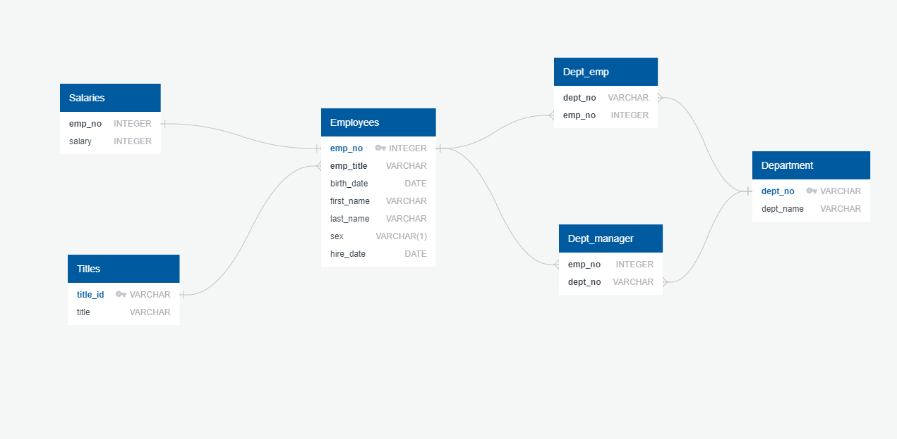

# sql-challenge

As a Data Engineer at Pewlett Hackard I was tasked with working on a research project on the employees that have worked for the corporation from the 1980s and 1990s. Using a series of CSV files, the goal is to be able to navigate through this in order to properly display the necessary info for the employees. This info could be their names, ID, gender, salary, job title, or what the specific departments are as well as who is the manager(s) for it.

After learning how to properly parse through the CSV files, the following questions were answered:

1. List the following details of each employee: employee number, last name, first name, sex, and salary.

2. List first name, last name, and hire date for employees who were hired in 1986.

3. List the manager of each department with the following information: department number, department name, the manager's employee number, last name, first name.

4. List the department of each employee with the following information: employee number, last name, first name, and department name.

5. List first name, last name, and sex for employees whose first name is "Hercules" and last names begin with "B."

6. List all employees in the Sales department, including their employee number, last name, first name, and department name.

7. List all employees in the Sales and Development departments, including their employee number, last name, first name, and department name.

8. In descending order, list the frequency count of employee last names, i.e., how many employees share each last name.

There is also a jupyter notebook (bonus_sql), that contains a histogram of the most common salaries as well as the average salary per specific job position.
